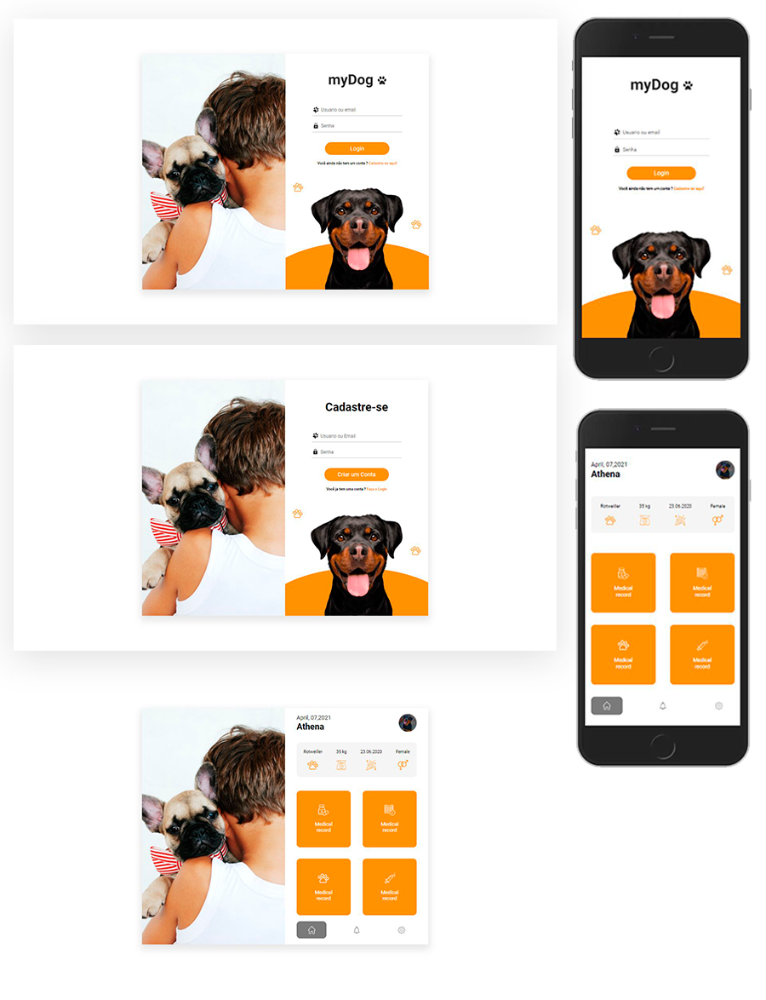

</br></br>

## ℹ️ Sobre o projeto

O projeto foi desenvolvido para um projeto que tem como tema um app de acompanhamento da saúde do seu cachorro.

## ✨ demonstração

</br>

</br>
Você pode conferir o resultado final em: https://ranek-store.netlify.app/

## 🎯 Objetivo do projeto

O objetivo desse projeto foi praticar e melhorar minhas habilidades em React.

## 📝 Tecnologias

Para a realização desse projeto foi utilizado as seguintes tecnologias/linguagens:

- [ReactJS](https://pt-br.reactjs.org) para criação da interface
- [React-router-dom](https://www.npmjs.com/package/react-router-dom) para criação de rotas
- [Styled Components](https://styled-components.com/) para estilização do css

## ⚙️ Instalação

Para que este rode em sua máquina, siga os passos abaixo:

```bash
# Clone o repositório em alguma pasta em sua máquina
$ git clone https://github.com/Diegooliveyra/MyDog.git

# Entre no repositório
$ cd mydog

Instale as dependencias digitando no termimal:
$ yarn

Rode a aplicação no modo de desenvolvimento.
$ yarn start

Abra http://localhost:3000 no seu navegador para visualizar o projeto
```

## 📝 Licença

<p>O projeto se encontra sob licença MIT. Para mais detalhes, acesse <a href='LICENSE'>license<a>.</p>
<p>Criado com 💙 por <a href='https://github.com/Diegooliveyra/' target='blank'>Diego Oliveira</a></p>
